# Wharf - Alpha - Web UI for Dokku

1. [About this fork](#about-this-fork)
2. [Pre requisites](#pre-requisites)
3. [Setup](#setup)
4. [Helpful hints](#helpful-hints)
5. [Enabling Github auto-deploy webhooks](#enabling-github-auto-deploy-webhooks)
6. [Development setup](#development-setup)
7. [Roadmap](#roadmap)
8. [Screenshots](#screenshots)

This is a forked version of Wharf. Check out the original project to more details.

Wharf is an web frontend for [Dokku](http://dokku.viewdocs.io/dokku/). 

Dokku it is a great Heroku-like tool, with a extensive command line operation. This web interface aims to 
simplify some routine tasks when managing applications on Dokku.

## About this fork

The original Wharf project has the functional backend needed. But the front-end was not usable at the time. So, this project
idea is to bring a modern and simple as possible front end interface to Wharfs functions.

## Features

With Wharf, you can manage all application generic activities with a web interface: application listing,
linking, state management, deploys and more to come.

## Screenshots

### Initial setup
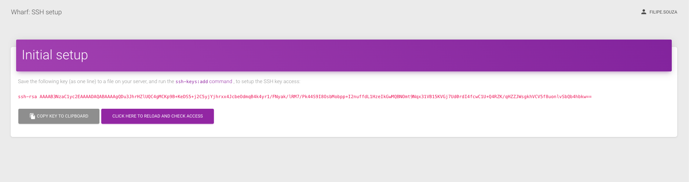

### Application list
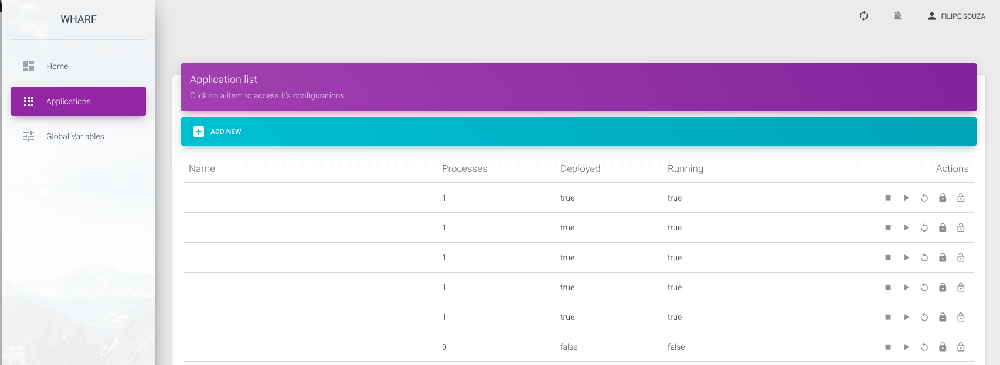

### Information navbar
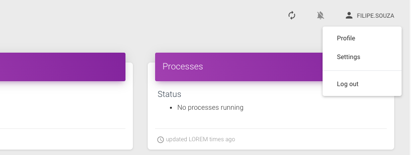

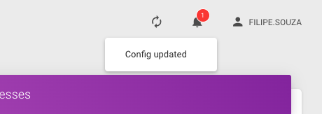

### Global environment variables
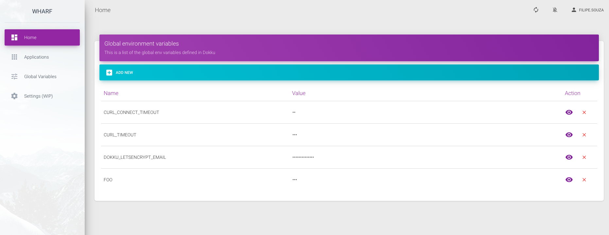

### Generic task log
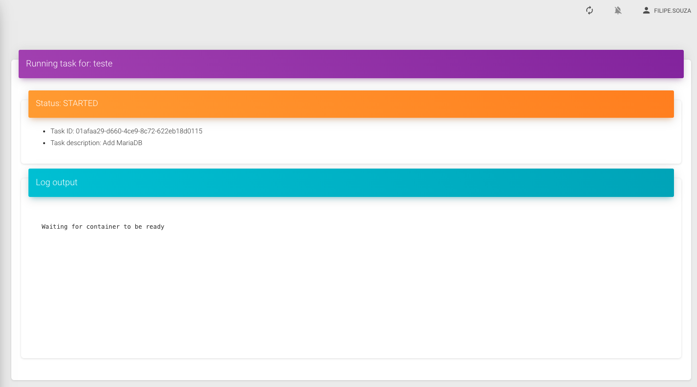

### Application details

Overview
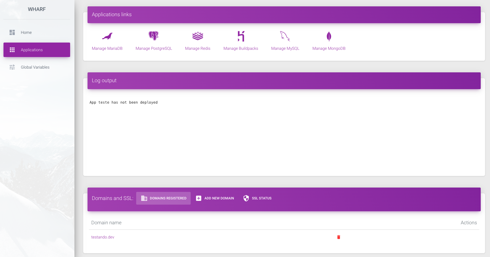

Logs
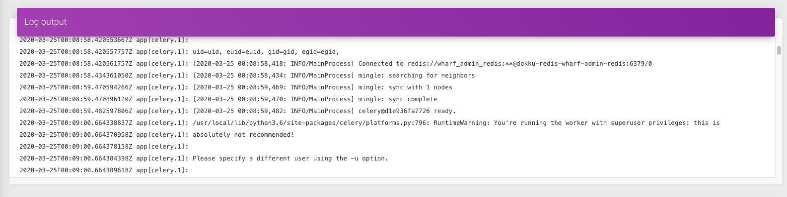

LetsEncrypt and SSL
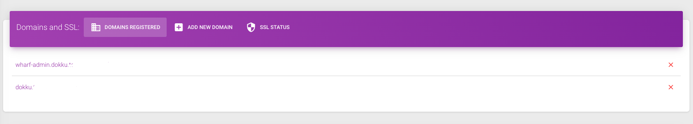

Environment variables
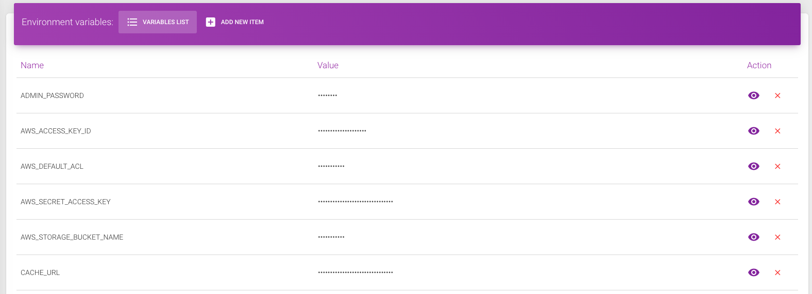

Environment variables
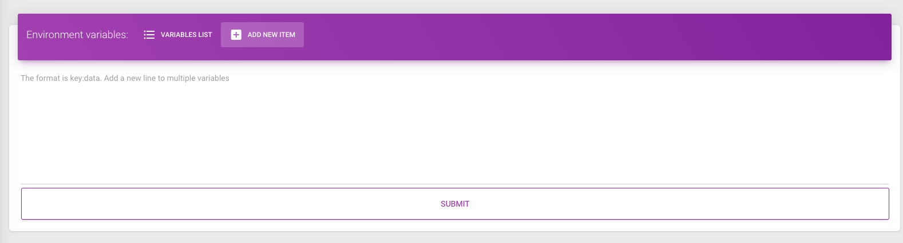

Application database link example
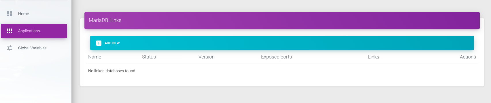

